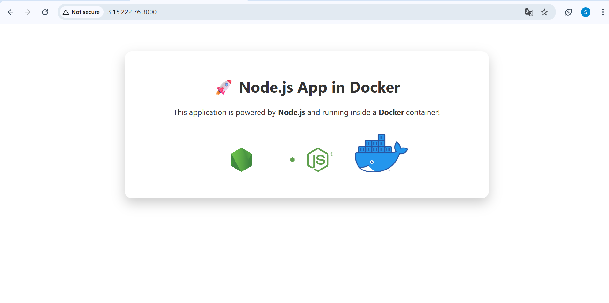

# 🌐 Node.js + Docker Web App

This is a simple and elegant Node.js web application with a clean frontend, designed to run inside a Docker container. It displays a landing page featuring Node.js and Docker branding.

---

## 🚀 Features

- Built with **Node.js** and **Express.js**
- Responsive and attractive **HTML/CSS** frontend
- Dockerized for easy deployment
- Works seamlessly on **local machines** or **cloud platforms like AWS EC2**

---

## 📁 Project Structure

```

nodejs-app/
├── Dockerfile
├── package.json
├── server.js
└── public/
├── index.html
└── style.css

```

---

## 🧑‍💻 Getting Started

### 1. Clone the Repository

```bash
git clone https://github.com/sejalsubhash/nodejs-docker.git
cd nodejs-docker
````

### 2. Install Dependencies (for local testing)

```bash
npm install
node server.js
```

Open your browser at: [http://localhost:3000](http://localhost:3000)

---

## 🐳 Run with Docker

### 1. Build the Docker Image

```bash
docker build -t nodejs-docker-app .
```

### 2. Run the Container

```bash
docker run -p 3000:3000 nodejs-docker-app
```

Visit: [http://localhost:3000](http://localhost:3000)

---

## 💻 Deploy on AWS EC2

1. Launch an EC2 instance (Ubuntu preferred)
2. Install Docker & Node.js
3. Clone this repo and build the image
4. Open port `3000` in EC2 security group
5. Access it via `http://<EC2-public-ip>:3000`

---

## 📸 Screenshot



---

## 🛠 Tech Stack

* Node.js
* Express.js
* HTML + CSS
* Docker

---

## 👤 Author

**Sejal Subhash Pawar**
[GitHub](https://github.com/sejalsubhash)

---

## 📄 License

This project is open-source and available under the [MIT License](LICENSE).


